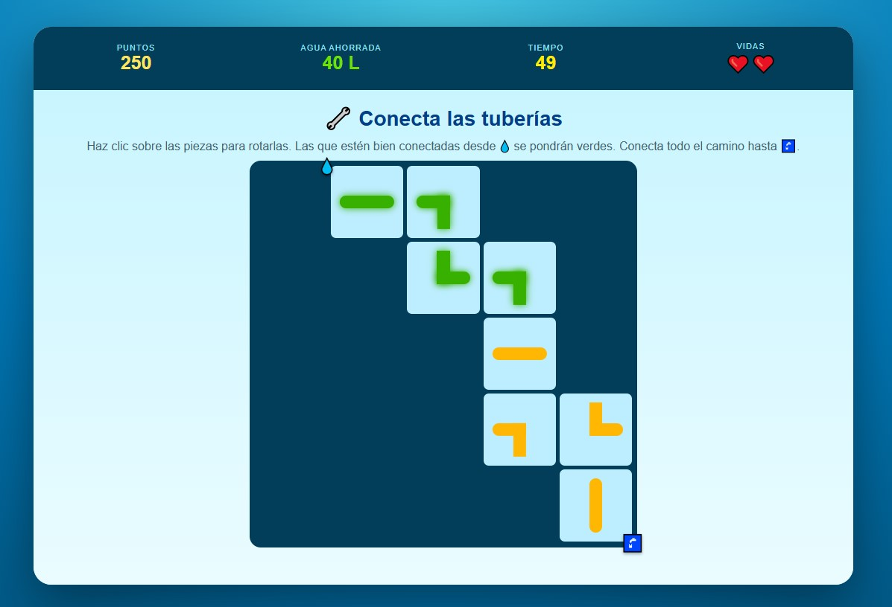
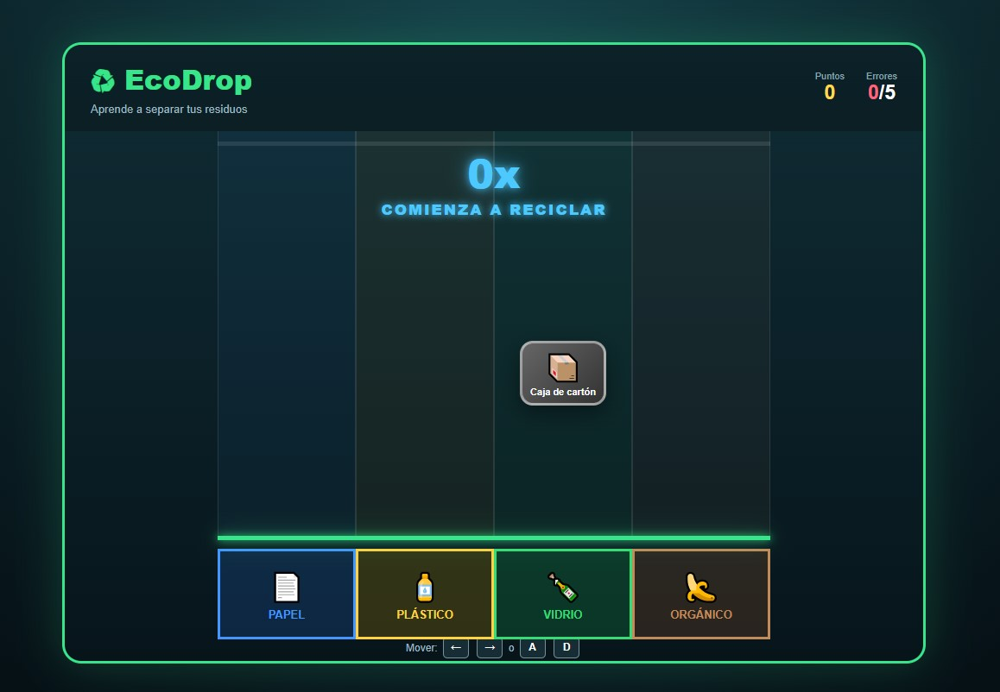
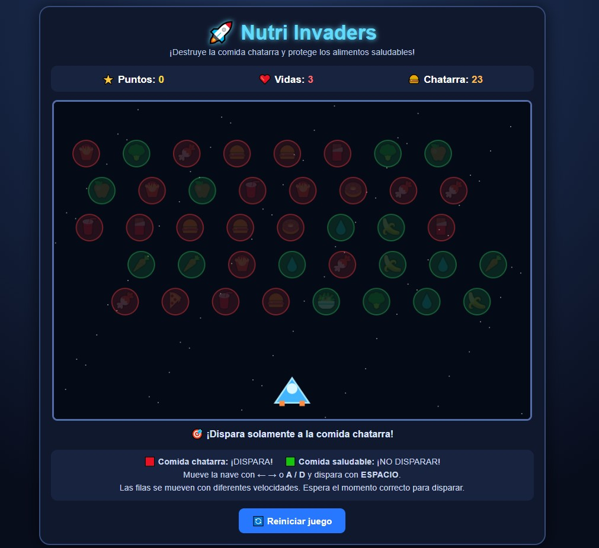
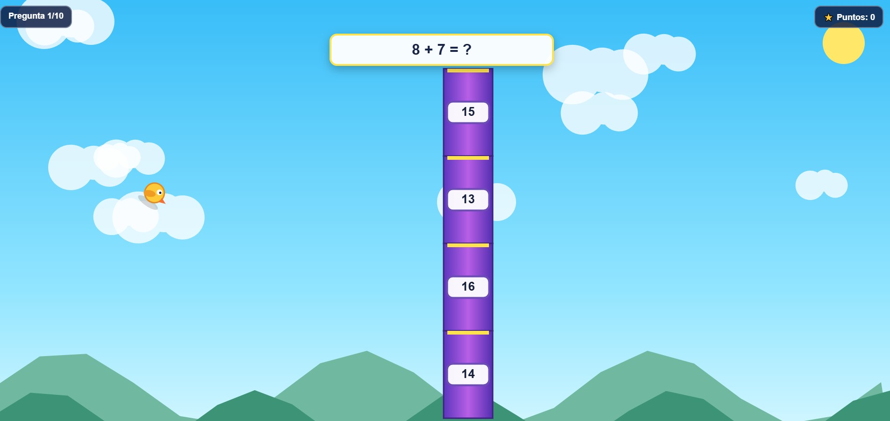

<div align="center">

# Americo's Game Development Portfolio

### Ideas, prototipos y experiencias creadas a través del desarrollo de videojuegos

**Portafolio de Game Development**

</div>

---

## Sobre mí

Hola, mi nombre es **Americo Oswaldo Ramirez Rocha**. Soy ingeniero de sistemas informáticos y me interesa el desarrollo de videojuegos, la programación, el diseño de mecánicas interactivas y la creación de experiencias educativas.

Este portafolio reúne los videojuegos y prototipos que desarrollé durante las primeras clases de la asignatura Game Development. Cada proyecto representa una oportunidad para experimentar con diferentes mecánicas, temáticas y formas de utilizar los videojuegos como herramientas de aprendizaje.

---

## Objetivo del portafolio

El objetivo de este repositorio es presentar de manera profesional, visual y organizada los videojuegos desarrollados. En cada proyecto se documentan:

*   La idea principal y el objetivo del jugador.
*   Las mecánicas y los controles.
*   Las tecnologías utilizadas.
*   Los elementos desarrollados con apoyo de inteligencia artificial.
*   Los aprendizajes obtenidos y posibles mejoras futuras.
*   Las instrucciones de ejecución.

---

## Galería de Proyectos

A continuación se presentan los videojuegos y prototipos desarrollados, organizados con sus respectivas capturas y enlaces a su documentación detallada.

---

### El Ministerio del Invierno (Proyecto Destacado)


**El Ministerio del Invierno** es un videojuego educativo de simulación y gestión financiera ambientado en una ciudad distópica afectada por una crisis energética. Durante el día, el jugador trabaja como analista de créditos; durante la noche, administra el dinero para evitar el embargo y proteger la salud de su familia.

*   **Género:** Simulación, estrategia y gestión de recursos.
*   **Estado:** Prototipo funcional (Desarrollo colaborativo basado en GDD).

[](./projects/ministerio-del-invierno/)
[](#)

---

### Reto Gota: Salva el Agua



**Reto Gota** es un videojuego educativo compuesto por minijuegos sobre el uso responsable del agua. El jugador dispone de 60 segundos para completar retos como cerrar llaves, reparar fugas y recolectar agua de lluvia.

*   **Género:** Educativo, arcade y colección de minijuegos.
*   **Estado:** Prototipo funcional.

[](./projects/reto-gota/)
[](#)

---

### EcoDrop: Clasifica y Recicla



**EcoDrop** es un juego de reflejos en el que distintos residuos caen por cuatro columnas. El objetivo es mover cada residuo hacia el contenedor correspondiente (papel, plástico, vidrio, orgánico) antes de que toque fondo.

*   **Género:** Educativo, arcade y juego de reflejos.
*   **Estado:** Prototipo funcional.

[](./projects/ecodrop/)
[](#)

---

### Nutri Invaders



**Nutri Invaders** es un shooter 2D educativo. El jugador controla una nave y debe destruir la comida chatarra para sumar puntos, evitando disparar a los alimentos saludables para no perder vidas.

*   **Género:** Arcade educativo y shooter 2D.
*   **Estado:** Prototipo funcional.

[](./projects/nutri-invaders/)
[](#)

---

### MathBirds



**MathBirds** es una aventura 2D en la que el jugador controla un personaje volador. A través de 10 preguntas de matemáticas básicas, el jugador debe maniobrar para atravesar la respuesta correcta.

*   **Género:** Educativo, arcade y aventura 2D.
*   **Estado:** Prototipo funcional.

[](./projects/mathbirds/)
[](#)

---

## Tecnologías y Herramientas

Todos los proyectos están contenidos en archivos HTML y se ejecutan de forma nativa en navegadores modernos sin dependencias externas. Se utilizaron las siguientes tecnologías:

*   HTML5 & CSS3
*   JavaScript (Vanilla) & Canvas 2D
*   Manipulación del DOM y Diseño Adaptable
*   Git, GitHub y GitHub Pages
*   Inteligencia artificial generativa (Apoyo al desarrollo)

---

## Desarrollo y Aprendizajes

### Mecánicas Exploradas
Los proyectos incluyen sistemas variados como: gestión de recursos, presupuestos, temporizadores, sistemas de puntuación/vidas, colisiones, movimiento vertical, minijuegos y dificultad progresiva.

### Uso de Inteligencia Artificial
La IA se integró de manera estructurada para agilizar etapas del desarrollo:
*   Generación de prototipos iniciales mediante prompts.
*   Revisión de fragmentos de código y detección de errores.
*   Apoyo en el diseño de documentación (GDD y READMEs).

### Aporte Personal
Mi trabajo se centró en dirigir estos proyectos desde la concepción hasta el despliegue final:
*   Definición de temáticas, mecánicas y condiciones lógicas (victoria/derrota).
*   Revisión, adaptación y corrección del código generado.
*   Estructuración de archivos y pruebas de calidad (QA).
*   Documentación exhaustiva de cada experiencia.

---

## Próximos Objetivos

*   Incorporar diseño sonoro (música y efectos especiales).
*   Mejorar animaciones y fluidez visual.
*   Implementar sistemas de persistencia (guardado de puntajes máximos).
*   Añadir opciones de accesibilidad y escalado de dificultad.
*   Realizar pruebas de usuario (Playtesting).

---

## Estructura del Repositorio

```text
game-development-portfolio/
├── README.md
└── projects/
    ├── ministerio-del-invierno/
    │   ├── index.html
    │   ├── README.md
    │   └── screenshots/
    ├── reto-gota/
    ├── ecodrop/
    ├── nutri-invaders/
    └── mathbirds/
