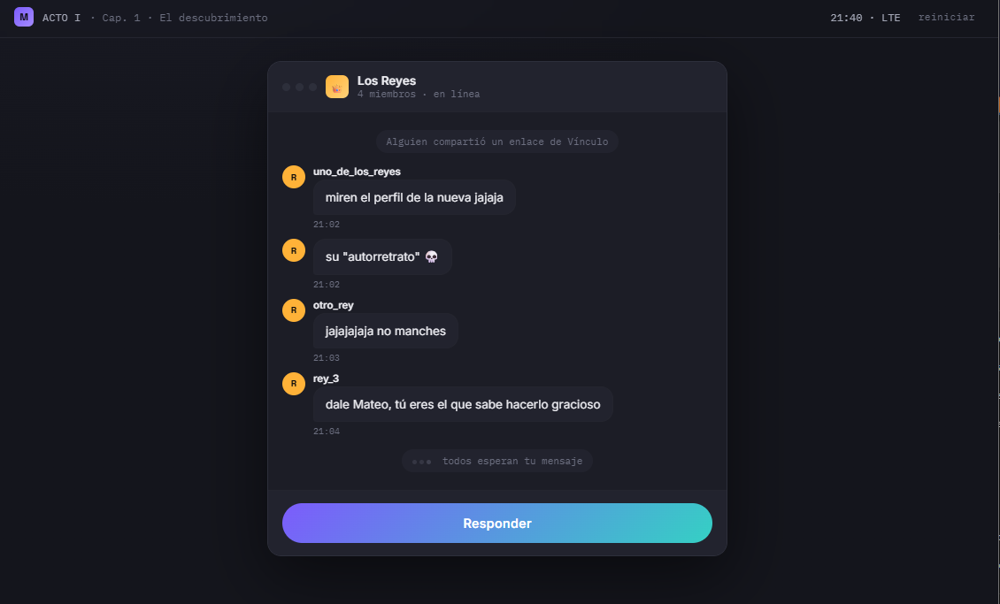
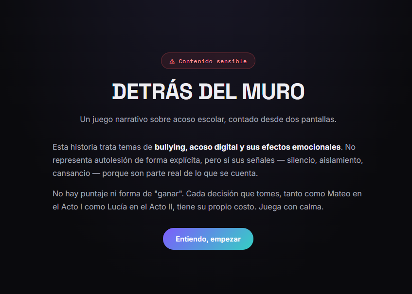
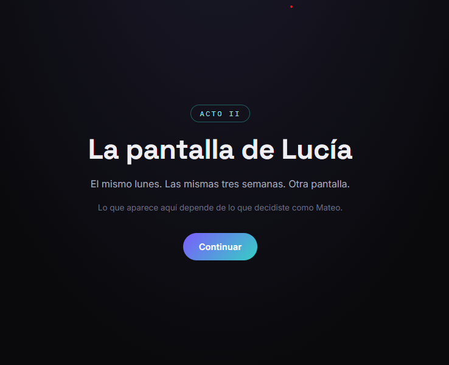
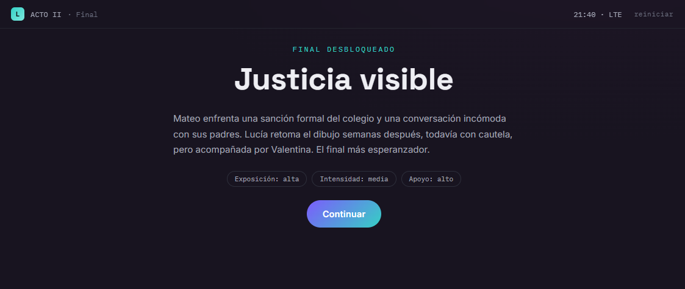

<div align="center">

# 🧱 Detrás del Muro

### Una historia interactiva contada desde dos pantallas



</div>

---

## ⚠️ Aviso de contenido

Este videojuego aborda temas relacionados con:

- Acoso escolar.
- Acoso digital.
- Humillación pública.
- Aislamiento.
- Consecuencias emocionales.
- Búsqueda de apoyo.

La historia no utiliza un sistema tradicional de puntos ni presenta las decisiones como respuestas completamente correctas o incorrectas.

Su propósito es mostrar que las acciones dentro y fuera de Internet pueden afectar de manera diferente a las personas involucradas.

---

## 📖 Descripción

**Detrás del Muro** es un videojuego narrativo interactivo sobre acoso escolar y acoso digital.

La historia se presenta desde dos perspectivas:

- **Mateo**, un estudiante que participa en las burlas de un grupo.
- **Lucía**, una estudiante que comienza a recibir comentarios y publicaciones ofensivas relacionadas con su arte.

Las decisiones tomadas durante la perspectiva de Mateo modifican lo que Lucía experimenta posteriormente.

El videojuego busca mostrar que una acción aparentemente pequeña puede extenderse, involucrar a otras personas y producir consecuencias que no siempre son visibles para quien inició el conflicto.

---

## 💡 Idea del proyecto

La idea principal es representar una misma situación desde dos pantallas y dos puntos de vista.

Durante el primer acto, el jugador observa cómo se origina y evoluciona el acoso desde la perspectiva de Mateo.

Durante el segundo acto, el jugador experimenta las consecuencias desde la perspectiva de Lucía.

La historia busca que el jugador reflexione sobre:

- La presión de grupo.
- La responsabilidad individual.
- El anonimato en Internet.
- La difusión de publicaciones.
- La importancia de intervenir.
- La búsqueda de apoyo.
- Las consecuencias de guardar silencio.
- La dificultad de identificar al responsable de una cuenta anónima.

---

## 🎯 Objetivo del jugador

El objetivo no consiste en acumular puntos ni alcanzar una puntuación máxima.

El jugador debe:

1. Explorar la historia.
2. Tomar decisiones desde la perspectiva de Mateo.
3. Observar las consecuencias de esas decisiones.
4. Continuar la historia desde la perspectiva de Lucía.
5. Decidir cómo responde ante la situación.
6. Llegar a uno de los finales posibles.
7. Reflexionar sobre las consecuencias de cada camino.

---

## 🧩 Género

- Narrativa interactiva.
- Aventura basada en decisiones.
- Drama educativo.
- Simulación de redes sociales.
- Experiencia de concientización.

---

## 👥 Personajes principales

### Mateo

Mateo forma parte de un chat grupal llamado **Los Reyes**.

Durante el primer acto debe decidir cómo reacciona cuando sus compañeros empiezan a burlarse de una publicación de Lucía.

Sus decisiones modifican:

- La visibilidad del acoso.
- La identidad del responsable.
- La frecuencia de las publicaciones.
- La cantidad de personas involucradas.
- Las posibilidades posteriores de presentar pruebas.

### Lucía

Lucía es una estudiante que comparte dibujos en una red social ficticia llamada **Vínculo**.

Durante el segundo acto debe decidir cómo responder después de descubrir las publicaciones y comentarios dirigidos contra ella.

Sus decisiones modifican:

- El nivel de apoyo que recibe.
- La posibilidad de informar lo sucedido.
- La intervención de personas adultas.
- La conservación o eliminación de su perfil.
- El desenlace de la historia.

### Valentina

Valentina es una posible figura de apoyo para Lucía.

Puede escucharla, acompañarla y ayudarla a comunicar la situación a una persona adulta.

### Profesora Rojas

La Profesora Rojas representa el canal institucional del colegio.

Su capacidad para actuar depende de:

- La existencia de pruebas.
- La identificación del responsable.
- Las decisiones tomadas anteriormente.
- La comunicación de la situación.

---

## 🔄 Estructura narrativa

La historia se divide en dos actos.

```text
ACTO I
La pantalla de Mateo
        ↓
Decisiones sobre la exposición y la intensidad
        ↓
ACTO II
La pantalla de Lucía
        ↓
Decisiones sobre apoyo y respuesta
        ↓
EPÍLOGO Y FINAL
```

Cada acto contiene tres capítulos.

---

## 👑 Acto I: la pantalla de Mateo

El primer acto presenta el origen y la evolución del conflicto desde la perspectiva de Mateo.

### Capítulo 1: el descubrimiento

Mateo encuentra una publicación de Lucía y observa cómo sus compañeros comienzan a burlarse.

El jugador puede elegir entre:

- Participar públicamente con la cuenta real de Mateo.
- Crear una cuenta anónima para publicar la burla.

Esta decisión determina si la exposición es directa o difusa.

### Capítulo 2: la presión del grupo

El grupo comienza a reconocer y celebrar la participación de Mateo.

El jugador puede:

- Intensificar y organizar el acoso.
- Intentar detenerlo parcialmente sin asumir completamente la responsabilidad.

Esta decisión modifica la frecuencia y la intensidad de las publicaciones posteriores.

### Capítulo 3: el límite

Las consecuencias comienzan a llamar la atención de otras personas.

Dependiendo de las decisiones previas:

- Una captura puede llegar a la Profesora Rojas.
- Valentina puede confrontar al grupo.
- La identidad del responsable puede ser clara o permanecer oculta.

---

## 📱 Acto II: la pantalla de Lucía

El segundo acto presenta la misma situación desde la perspectiva de Lucía.

Lo que aparece en pantalla depende de las decisiones tomadas durante el primer acto.

### Capítulo 1: la primera notificación

Lucía descubre los comentarios o publicaciones.

Si Mateo utilizó su cuenta real, Lucía puede identificar inmediatamente quién inició la burla.

Si se utilizó una cuenta anónima, la situación genera incertidumbre y desconfianza.

Lucía puede:

- Aislarse y cerrar las notificaciones.
- Buscar apoyo en Valentina.

### Capítulo 2: enfrentar o desaparecer

Después de varios días, Lucía debe decidir cómo responder.

Puede:

- Guardar pruebas y reportar formalmente la situación.
- Eliminar su cuenta y dejar de compartir su trabajo.

La efectividad del reporte depende de las pruebas y del apoyo conseguido anteriormente.

### Capítulo 3: después

La historia muestra las pantallas de Mateo y Lucía al mismo tiempo.

El epílogo refleja cómo las decisiones anteriores modificaron la experiencia de ambos personajes.

---

## ⚙️ Mecánica principal

La mecánica principal consiste en seleccionar decisiones narrativas.

En los puntos importantes aparecen dos opciones.

Cada opción modifica variables internas como:

- Exposición.
- Intensidad.
- Apoyo.
- Respuesta ante la situación.

Estas variables determinan:

- Qué escenas aparecen.
- Qué mensajes reciben los personajes.
- Quién puede identificar al responsable.
- Si existe acompañamiento.
- La capacidad de presentar pruebas.
- El final obtenido.

---

## 🕹️ Controles

El juego se controla con mouse, panel táctil o pantalla táctil.

- `CLIC`: abrir aplicaciones y conversaciones.
- `CLIC EN UNA OPCIÓN`: seleccionar una decisión.
- `CLIC EN CONTINUAR`: avanzar en la historia.
- `CLIC EN REINICIAR`: volver al comienzo.
- `DESPLAZAMIENTO`: leer conversaciones o contenidos largos.

No se necesita utilizar el teclado.

---

## 🖥️ Interfaz

El videojuego presenta una interfaz inspirada en un sistema operativo.

El jugador puede observar elementos como:

- Escritorio digital.
- Barra de estado.
- Aplicaciones ficticias.
- Chats grupales.
- Red social ficticia.
- Notificaciones.
- Publicaciones.
- Comentarios.
- Mensajes privados.
- Pantallas divididas.
- Tarjetas de decisión.

El cambio de perspectiva también modifica los colores y la identidad de la interfaz.

---

## 🌐 Aplicaciones ficticias

### Vínculo

Vínculo es la red social en la que Lucía comparte sus dibujos.

Permite representar:

- Publicaciones.
- Comentarios.
- Reacciones.
- Perfiles.
- Cuentas anónimas.
- Notificaciones.

### Los Reyes

Los Reyes es el chat grupal en el que Mateo conversa con sus compañeros.

Representa:

- La presión de grupo.
- La difusión de burlas.
- La búsqueda de aprobación.
- La participación colectiva.
- La normalización de acciones perjudiciales.

### Mensajes y notificaciones

Las aplicaciones de mensajería y notificaciones muestran cómo una publicación puede pasar de un espacio público a conversaciones privadas y canales institucionales.

---

## 🔀 Sistema de decisiones

El juego utiliza cuatro variables narrativas principales.

### Exposición

Puede ser:

```text
Alta
Difusa
```

La exposición alta permite identificar fácilmente al responsable, pero hace que la acción sea directamente visible.

La exposición difusa oculta la identidad, dificulta la denuncia y puede generar desconfianza hacia otras personas.

### Intensidad

Puede ser:

```text
Alta
Media
```

La intensidad alta representa una situación repetida y organizada.

La intensidad media reduce la frecuencia, aunque no elimina el daño ya causado.

### Apoyo

Puede ser:

```text
Alto
Bajo
```

El apoyo alto aparece cuando Lucía habla con Valentina y obtiene acompañamiento.

El apoyo bajo aparece cuando decide enfrentar la situación completamente sola.

### Respuesta

Lucía puede:

```text
Reportar formalmente
Desaparecer de la plataforma
```

La respuesta formal puede conducir a una intervención, especialmente cuando existen pruebas claras.

Eliminar la cuenta puede detener parte de la exposición directa, pero no resuelve necesariamente lo sucedido.

---

## 🧭 Finales

El videojuego presenta cuatro finales principales.

### Silencio

Este final aparece cuando la exposición es alta, pero Lucía no encuentra apoyo.

La historia muestra el costo del aislamiento y de una situación que no fue comunicada a tiempo.

### Justicia visible

Este final aparece cuando la exposición permite identificar al responsable y Lucía recibe apoyo.

El colegio interviene y las personas involucradas enfrentan consecuencias.

### La sombra persiste

Este final aparece cuando el responsable permanece oculto y Lucía no recibe apoyo suficiente.

La falta de claridad impide una resolución completa.

### Grietas de luz

Este final aparece cuando la identidad no es completamente clara, pero Lucía cuenta con apoyo.

Aunque no todas las preguntas se resuelven, la compañía permite iniciar una recuperación.

---

## 🏆 Sistema de progreso

Detrás del Muro no utiliza:

- Puntos.
- Monedas.
- Vidas.
- Clasificaciones.
- Tablas de posiciones.

El progreso se mide mediante:

- Los capítulos completados.
- Las decisiones tomadas.
- Las variables narrativas.
- El final desbloqueado.

No existe un único final correcto. Cada desenlace comunica una consecuencia diferente.

---

## 🎨 Estilo visual

El juego utiliza una estética digital oscura y contemporánea.

Entre sus características se encuentran:

- Fondos oscuros.
- Paneles similares a ventanas de escritorio.
- Colores violeta, turquesa y azul.
- Tonos diferentes para Mateo y Lucía.
- Tipografía moderna.
- Interfaces de chats y redes sociales.
- Transiciones cinematográficas.
- Efectos de reducción de brillo.
- Pantallas divididas.
- Diseño adaptable a diferentes tamaños de pantalla.

El oscurecimiento progresivo de la interfaz se utiliza como recurso visual para representar el peso emocional de algunas decisiones.

---

## 🖼️ Capturas de pantalla

### Pantalla inicial

La pantalla inicial presenta el título, una advertencia de contenido y una explicación breve de la experiencia.



### Gameplay 1: la pantalla de Mateo

Durante el primer acto, el jugador explora el escritorio de Mateo, abre aplicaciones, lee conversaciones y toma decisiones relacionadas con su participación en el grupo.


### Gameplay 2: la pantalla de Lucía

Durante el segundo acto, el jugador observa las consecuencias desde la perspectiva de Lucía y decide cómo responde ante las notificaciones y publicaciones.



### Pantalla final

El juego presenta uno de cuatro finales según la combinación de decisiones tomadas en ambos actos.



---

## 🛠️ Tecnologías utilizadas

- HTML5.
- CSS3.
- JavaScript.
- Manipulación del DOM.
- Sistema de estados.
- Renderizado dinámico de escenas.
- Diseño web adaptable.
- Animaciones CSS.
- Variables CSS.
- Interfaces narrativas.
- Fuentes web.
- GitHub para organización, documentación y publicación.

El videojuego está contenido principalmente en un solo archivo HTML.

---

## 🌍 Dependencias externas

El juego utiliza fuentes provenientes de Google Fonts:

- Space Grotesk.
- Inter.
- IBM Plex Mono.

Si el dispositivo no tiene conexión a Internet, el juego seguirá funcionando, pero utilizará fuentes alternativas instaladas en el sistema.

---

## ▶️ Cómo ejecutar el juego

### Ejecución local

1. Descarga el archivo `index.html`.
2. Ábrelo con Chrome, Edge o Firefox.
3. Lee el aviso inicial.
4. Presiona **ENTIENDO, EMPEZAR**.
5. Explora las aplicaciones.
6. Lee las conversaciones.
7. Selecciona las decisiones.
8. Completa los dos actos.
9. Descubre uno de los finales.
10. Reinicia el juego para explorar otro camino.

### Versión en línea

La versión jugable se habilitará mediante GitHub Pages.

<div align="center">

https://img.shields.io/badge/Jugar-Próximamente-64748B?style=for-the-badge

</div>

---

## 🤖 Uso de inteligencia artificial

La inteligencia artificial generativa fue utilizada como herramienta de apoyo para desarrollar y estructurar el prototipo.

Su apoyo incluyó:

- Organización de la narrativa.
- Propuesta de una estructura dividida en actos.
- Desarrollo de las interfaces.
- Creación del sistema de estados.
- Implementación de las decisiones.
- Diseño de las consecuencias narrativas.
- Organización de los diferentes finales.
- Revisión de la estructura HTML, CSS y JavaScript.
- Apoyo en la documentación del proyecto.

El resultado fue revisado y probado para comprobar que las decisiones modificaran correctamente las escenas y los finales.

### Aporte personal

Mi participación en el proyecto incluyó:

- La selección y revisión de la temática.
- La evaluación del enfoque narrativo.
- La revisión de las decisiones.
- Las pruebas de los diferentes caminos.
- La verificación de los finales.
- La comprobación de la navegación.
- La organización de los archivos.
- La documentación y presentación del videojuego.
- La identificación de posibles mejoras.

---

## 📚 Aprendizajes

Durante el desarrollo de este proyecto aprendí a:

- Diseñar una narrativa interactiva.
- Utilizar decisiones con consecuencias.
- Conservar el estado de una partida.
- Modificar escenas según variables internas.
- Construir diferentes finales.
- Representar dos perspectivas dentro de una historia.
- Diseñar interfaces inspiradas en aplicaciones.
- Utilizar el diseño visual como recurso narrativo.
- Tratar una temática sensible con advertencias y recursos de orientación.
- Probar distintas rutas narrativas.
- Documentar un videojuego centrado en decisiones.

---

## 🔧 Mejoras futuras

En una siguiente versión me gustaría:

- Incorporar música ambiental y efectos de sonido.
- Añadir transiciones entre más escenas.
- Permitir guardar el progreso.
- Incorporar más decisiones intermedias.
- Agregar un historial de decisiones al final.
- Mejorar la accesibilidad.
- Incluir controles completos mediante teclado.
- Permitir ajustar el tamaño del texto.
- Añadir más recursos de orientación según el país.
- Realizar pruebas con estudiantes y personal educativo.
- Revisar el contenido con profesionales de orientación escolar.
- Incorporar más caminos de intervención y acompañamiento.

---

## 📂 Estructura del proyecto

```text
detras-del-muro/
├── README.md
├── index.html
└── screenshots/
    ├── inicio.jpg
    ├── gameplay1.jpg
    ├── gameplay2.jpg
    └── fin.jpg
```

- `README.md`: documentación del videojuego.
- `index.html`: archivo funcional y ejecutable.
- `screenshots/inicio.jpg`: advertencia y pantalla inicial.
- `screenshots/gameplay1.jpg`: perspectiva de Mateo.
- `screenshots/gameplay2.jpg`: perspectiva de Lucía.
- `screenshots/fin.jpg`: uno de los finales posibles.

---

## 👤 Autor

**Americo Oswaldo Ramirez Rocha**

Proyecto desarrollado para la asignatura **Game Development**.

---

<div align="center">

https://img.shields.io/badge/Volver-Proyectos-7B2CBF?style=for-the-badge](../)

https://img.shields.io/badge/Volver-Portafolio-0078D4?style=for-the-badge](../../)

</div>
