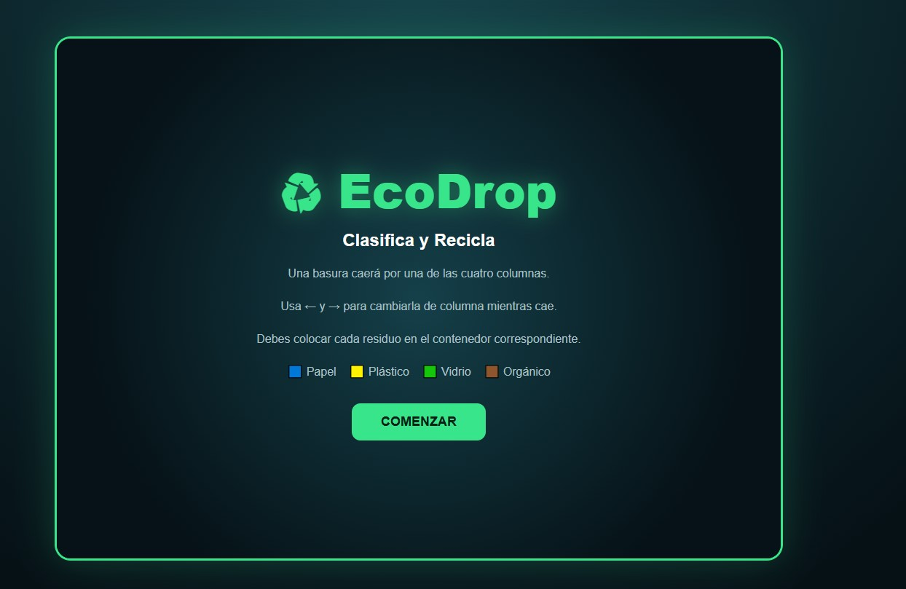
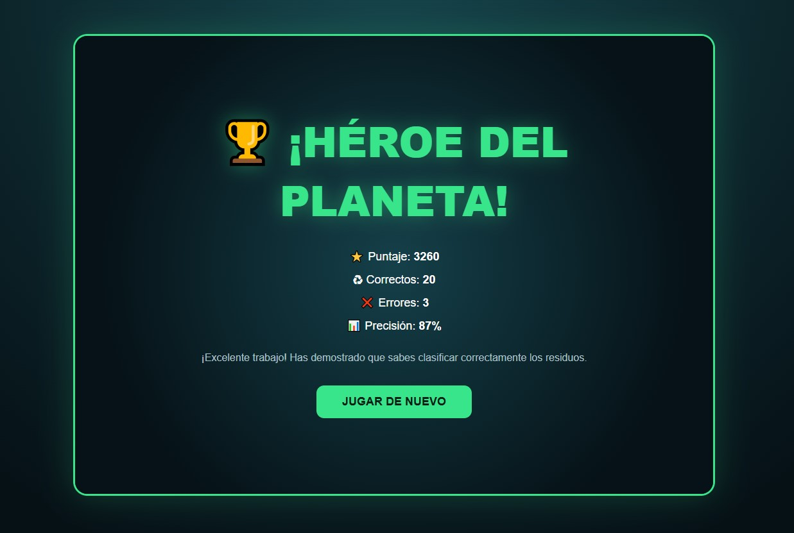

<div align="center">

# EcoDrop

### Clasifica, recicla y conviértete en un héroe del planeta


</div>

---

## 📖 Descripción

**EcoDrop: Clasifica y Recicla** es un videojuego educativo en el que diferentes residuos caen verticalmente por una zona dividida en cuatro columnas.

El jugador debe mover cada residuo hacia el contenedor correcto antes de que llegue a la zona de clasificación.

El proyecto busca enseñar a identificar y separar correctamente residuos de papel, plástico, vidrio y material orgánico mediante una experiencia rápida, visual e interactiva.

---

## 💡 Idea del proyecto

La idea principal de EcoDrop es convertir el aprendizaje sobre reciclaje en una actividad basada en reflejos y toma rápida de decisiones.

En lugar de presentar únicamente preguntas teóricas, el videojuego permite aprender mediante la clasificación directa de diferentes objetos.

Cuando el jugador comete un error, el juego indica cuál era el contenedor correcto para ayudarle a reconocer y recordar la categoría del residuo.

---

## 🎯 Objetivo del jugador

El objetivo es clasificar correctamente 20 residuos antes de cometer 5 errores.

Para conseguirlo, el jugador debe:

1. Observar el residuo que está cayendo.
2. Identificar a qué categoría pertenece.
3. Moverlo hacia la columna correspondiente.
4. Mantener una racha de respuestas correctas.
5. Alcanzar las 20 clasificaciones correctas.

---

## 🧩 Género

- Educativo.
- Arcade.
- Juego de reflejos.
- Clasificación y aprendizaje ambiental.

---

## ⚙️ Mecánica principal

La zona de juego está dividida en cuatro columnas:

- Papel.
- Plástico.
- Vidrio.
- Orgánico.

Un residuo aparece en la parte superior y comienza a caer. Mientras desciende, el jugador puede moverlo horizontalmente entre las cuatro columnas.

Cuando el residuo llega a la parte inferior, el juego comprueba si se encuentra en el contenedor adecuado.

Una clasificación correcta aumenta la puntuación y el combo. Una clasificación incorrecta aumenta el contador de errores y reinicia el combo.

---

## 🕹️ Controles

- `FLECHA IZQUIERDA`: mover el residuo una columna hacia la izquierda.
- `FLECHA DERECHA`: mover el residuo una columna hacia la derecha.
- `A`: mover el residuo una columna hacia la izquierda.
- `D`: mover el residuo una columna hacia la derecha.

El residuo no puede salir de los límites de las cuatro columnas.

---

## 🗑️ Categorías de reciclaje

### 🟦 Papel

Algunos residuos pertenecientes a esta categoría son:

- Caja de cartón.
- Periódico.
- Hoja de papel.

### 🟨 Plástico

Algunos residuos pertenecientes a esta categoría son:

- Botella plástica.
- Bolsa plástica.
- Envase plástico.

### 🟩 Vidrio

Algunos residuos pertenecientes a esta categoría son:

- Botella de vidrio.
- Frasco de vidrio.

### 🟫 Orgánico

Algunos residuos pertenecientes a esta categoría son:

- Cáscara de plátano.
- Cáscara de manzana.
- Restos de comida.

---

## 🏆 Sistema de puntuación

El juego incluye:

- Puntuación acumulada.
- Número de errores.
- Progreso de la partida.
- Sistema de combos.
- Bonificación por respuestas correctas consecutivas.

La puntuación obtenida por una clasificación correcta aumenta según el combo actual.

```text
Puntos obtenidos = 100 + combo × 10
```

Una clasificación incorrecta rompe la racha y reinicia el combo.

---

## 🔥 Sistema de combos

Las respuestas correctas consecutivas permiten alcanzar distintos niveles:

- `3x`: ¡Racha!
- `5x`: ¡Reciclador!
- `8x`: ¡Experto verde!
- `12x`: ¡Maestro del reciclaje!
- `16x`: ¡Leyenda Eco!
- `20x`: ¡Héroe del planeta!

El sistema de combos recompensa la precisión y motiva al jugador a clasificar correctamente varios residuos de manera consecutiva.

---

## 📈 Dificultad progresiva

La velocidad de caída aumenta después de cada clasificación correcta.

Esto hace que el jugador disponga de menos tiempo para:

- Reconocer el residuo.
- Identificar su categoría.
- Moverlo hacia la columna correcta.

La dificultad aumenta progresivamente durante la partida.

---

## ✅ Condición de victoria

El jugador gana al clasificar correctamente:

```text
20 residuos
```

Al completar el objetivo aparece la pantalla:

```text
¡HÉROE DEL PLANETA!
```

---

## ❌ Condición de derrota

La partida termina cuando el jugador alcanza:

```text
5 errores
```

El juego muestra un mensaje que invita a continuar practicando y recordar el contenedor adecuado para cada residuo.

---

## 💬 Retroalimentación educativa

Después de clasificar un residuo, el videojuego informa si la decisión fue correcta o incorrecta.

### Clasificación correcta

El juego:

- Muestra un mensaje de acierto.
- Aumenta la puntuación.
- Incrementa el combo.
- Actualiza el progreso.

### Clasificación incorrecta

El juego:

- Muestra un mensaje de error.
- Indica el contenedor correcto.
- Aumenta el contador de errores.
- Reinicia el combo.

Esta retroalimentación permite que el jugador aprenda de sus equivocaciones.

---

## 🖼️ Capturas de pantalla

### Pantalla inicial

La pantalla inicial presenta el nombre del videojuego, las cuatro categorías de reciclaje, los controles y el botón para comenzar.



### Gameplay

Durante la partida, el jugador observa el residuo que está cayendo, las cuatro columnas, los contenedores, la puntuación, el combo y el número de errores.


### Pantalla final

La pantalla final muestra el resultado de la partida, la puntuación, la cantidad de clasificaciones correctas, los errores y el porcentaje de precisión.



---

## 🛠️ Tecnologías utilizadas

- HTML5.
- CSS3.
- JavaScript.
- Diseño web responsivo.
- Animaciones CSS.
- GitHub para organización, documentación y publicación.

Todo el videojuego está contenido en un único archivo `index.html`.

No requiere instalar programas adicionales y puede ejecutarse directamente en un navegador moderno.

---

## ▶️ Cómo ejecutar el juego

### Ejecución local

1. Descarga el archivo `index.html`.
2. Abre el archivo con Chrome, Edge o Firefox.
3. Presiona el botón **COMENZAR**.
4. Observa el residuo que aparece.
5. Utiliza las flechas o las teclas `A` y `D`.
6. Coloca el residuo en el contenedor correspondiente.
7. Clasifica correctamente 20 residuos antes de llegar a 5 errores.

### Versión en línea

La versión jugable se habilitará cuando el portafolio sea publicado mediante GitHub Pages.

<div align="center">

https://img.shields.io/badge/Jugar-Próximamente-808080?style=for-the-badge

</div>

---

## 🤖 Uso de inteligencia artificial

La inteligencia artificial generativa fue utilizada como herramienta de apoyo para desarrollar el prototipo inicial mediante un prompt detallado.

El prompt definió:

- El objetivo educativo.
- Las cuatro categorías de reciclaje.
- Los residuos disponibles.
- La mecánica de caída.
- Los controles de movimiento.
- El sistema de puntuación.
- El sistema de combos.
- La dificultad progresiva.
- Las condiciones de victoria y derrota.
- La retroalimentación educativa.
- Los requisitos técnicos y visuales.

El código generado fue revisado y probado para verificar su funcionamiento en el navegador.

### Aporte personal

Mi participación en el proyecto incluyó:

- La definición y revisión de los requisitos.
- La selección de la temática educativa.
- La revisión del funcionamiento de los controles.
- La comprobación de las categorías de reciclaje.
- Las pruebas del sistema de puntuación y combos.
- La verificación de las condiciones de victoria y derrota.
- La organización del proyecto en GitHub.
- La documentación y presentación del videojuego.
- La identificación de posibles mejoras.

---

## 📚 Aprendizajes

Durante el desarrollo de este proyecto aprendí a:

- Diseñar un videojuego con un objetivo educativo.
- Convertir un tema ambiental en una mecánica interactiva.
- Definir controles sencillos para un videojuego web.
- Utilizar condiciones de victoria y derrota.
- Implementar un sistema de puntuación y combos.
- Aplicar dificultad progresiva.
- Proporcionar retroalimentación después de cada acción.
- Probar un videojuego directamente en el navegador.
- Organizar y documentar un proyecto en GitHub.

---

## 🔧 Mejoras futuras

En una siguiente versión me gustaría:

- Agregar controles táctiles para dispositivos móviles.
- Incorporar efectos de sonido y música.
- Añadir más tipos de residuos.
- Incluir categorías adicionales de reciclaje.
- Mostrar explicaciones educativas más detalladas.
- Incorporar diferentes niveles de dificultad.
- Agregar una pantalla de pausa.
- Guardar las mejores puntuaciones.
- Mejorar la accesibilidad visual.
- Realizar pruebas con estudiantes.

---

## 📂 Estructura del proyecto

```text
ecodrop/
├── README.md
├── index.html
└── screenshots/
    ├── inicio.jpg
    ├── gameplay.jpg
    └── fin.jpg
```

- `README.md`: documentación del videojuego.
- `index.html`: archivo completo y ejecutable.
- `screenshots/inicio.jpg`: captura de la pantalla inicial.
- `screenshots/gameplay.jpg`: captura de la partida.
- `screenshots/fin.jpg`: captura de la pantalla final.

---

## 👤 Autor

**Americo Oswaldo Ramirez Rocha**

Proyecto desarrollado para la asignatura **Game Development**.

---

<div align="center">

https://img.shields.io/badge/Volver-Proyectos-7B2CBF?style=for-the-badge](../)

https://img.shields.io/badge/Volver-Portafolio-0078D4?style=for-the-badge](../../)

</div>
