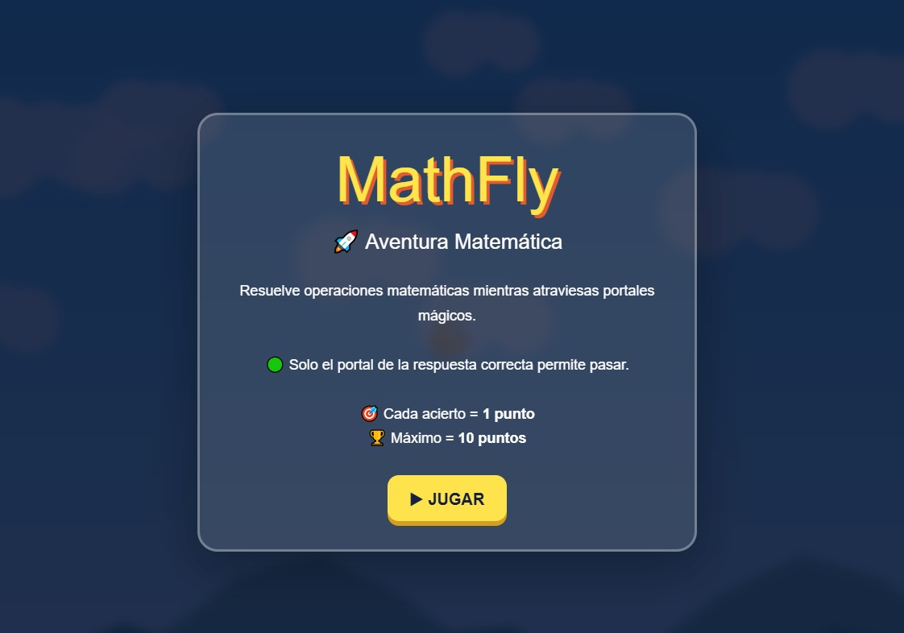
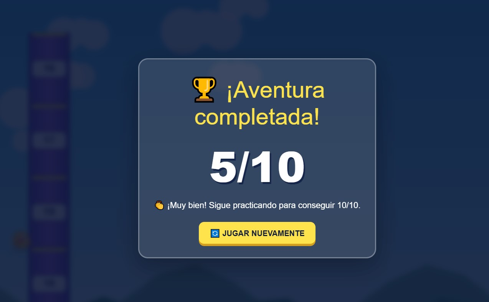

<div align="center">

# 🐦 MathBirds

### Aventura matemática educativa


</div>

---

## 📖 Descripción

**MathBirds** es un videojuego educativo 2D en el que el jugador controla un personaje volador mientras resuelve operaciones matemáticas.

Durante cada partida se presentan 10 preguntas. Para responder, el jugador debe mover al personaje verticalmente y atravesar la opción que considere correcta.

El proyecto combina el aprendizaje de matemáticas con una mecánica arcade de desplazamiento lateral.

---

## 🎯 Objetivo del jugador

El objetivo es resolver correctamente las 10 operaciones matemáticas y obtener la mayor puntuación posible.

Cada respuesta correcta otorga 1 punto y la puntuación máxima es de 10 puntos.

---

## 🧩 Género

- Videojuego educativo.
- Aventura 2D.
- Arcade.
- Inspirado en mecánicas de desplazamiento lateral.

---

## ⚙️ Mecánica principal

El personaje avanza mientras el jugador controla su movimiento vertical.

En cada pregunta aparecen cuatro posibles respuestas. El jugador debe posicionar al personaje en el carril de la respuesta que considera correcta.

El juego informa si la respuesta fue correcta o incorrecta y continúa con la siguiente pregunta.

---

## 🕹️ Controles

- `ESPACIO`: impulsar al personaje hacia arriba.
- `FLECHA ARRIBA`: impulsar al personaje hacia arriba.
- `CLIC`: impulsar al personaje utilizando el mouse.
- `TOQUE EN PANTALLA`: impulsar al personaje en dispositivos táctiles.

---

## 🖼️ Capturas de pantalla

### Pantalla inicial

La pantalla inicial presenta el nombre del videojuego, una explicación de su objetivo y el botón para comenzar.



### Gameplay

Durante la partida se muestra una operación matemática, cuatro alternativas, el progreso de las preguntas y la puntuación obtenida.


### Resultado final

Después de completar las 10 preguntas, el videojuego muestra la puntuación final y un mensaje basado en el desempeño obtenido.



---

## ➕ Contenido matemático

El juego contiene ejercicios de:

- Suma.
- Resta.
- Multiplicación.
- División.

Cada partida selecciona 10 preguntas y presenta cuatro alternativas por pregunta.

---

## 🏆 Sistema de puntuación

- Respuesta correcta: 1 punto.
- Respuesta incorrecta: 0 puntos.
- Puntuación máxima: 10 puntos.
- Al terminar aparece un mensaje de acuerdo con el desempeño.

---

## 🛠️ Tecnologías utilizadas

- HTML5.
- CSS3.
- JavaScript.
- Canvas 2D.
- Navegador web.
- GitHub para publicación y documentación.

El videojuego está contenido en un único archivo HTML, no requiere instalación y puede ejecutarse directamente desde un navegador compatible.

---

## ▶️ Cómo jugar

### Ejecución local

1. Descarga el archivo `index.html`.
2. Abre el archivo con Chrome, Edge o Firefox.
3. Presiona el botón **JUGAR**.
4. Lee las instrucciones.
5. Utiliza los controles para seleccionar las respuestas.
6. Completa las 10 preguntas.

### Versión en línea

El botón para jugar directamente desde el navegador se habilitará cuando el portafolio sea publicado mediante GitHub Pages.

<div align="center">

![Jugar próximamente](https://img.shields.io/badge/Jugar-Próximamente-808080?style=
---

## 🤖 Uso de inteligencia artificial

La inteligencia artificial generativa fue utilizada como herramienta de apoyo para crear el prototipo mediante un prompt detallado.

El prompt definió:

- El objetivo educativo.
- La mecánica principal.
- Las operaciones matemáticas.
- El sistema de puntuación.
- Los controles.
- Las pantallas del videojuego.
- Los requisitos técnicos y visuales.

El resultado generado fue revisado y probado para comprobar su funcionamiento en el navegador.

### Aporte personal

Mi participación en el proyecto incluyó:

- La definición y revisión de los requisitos.
- La evaluación del funcionamiento del videojuego.
- Las pruebas de las preguntas y respuestas.
- La comprobación del sistema de puntuación.
- La organización del proyecto en GitHub.
- La documentación y presentación del resultado.
- La identificación de posibles mejoras futuras.

---

## 📚 Aprendizajes

Durante el desarrollo de este proyecto aprendí a:

- Definir requisitos para un videojuego educativo.
- Diseñar una mecánica basada en preguntas y respuestas.
- Utilizar un prompt detallado para generar un prototipo.
- Probar el funcionamiento de un videojuego.
- Ejecutar un proyecto HTML directamente en el navegador.
- Organizar archivos y capturas de manera profesional.
- Documentar un videojuego para publicarlo en GitHub.

---

## 🔧 Mejoras futuras

En una siguiente versión me gustaría:

- Agregar efectos de sonido y música.
- Mejorar las animaciones del personaje.
- Incorporar diferentes niveles de dificultad.
- Añadir más variedad de preguntas.
- Mejorar la experiencia en dispositivos móviles.
- Realizar pruebas con estudiantes.
- Agregar una tabla de mejores puntuaciones.

---

## 📂 Estructura del proyecto

```text
mathbirds/
├── README.md
├── index.html
└── screenshots/
    ├── start-screen.png
    ├── gameplay.png
    └── result-screen.png
```

- `README.md`: documentación del videojuego.
- `index.html`: archivo completo y ejecutable.
- `screenshots/start-screen.png`: pantalla inicial.
- `screenshots/gameplay.png`: momento de juego.
- `screenshots/result-screen.png`: resultado final.

---

## 👤 Autor

**Americo Oswaldo Ramirez Rocha**

Proyecto desarrollado para la asignatura **Game Development**.

---

<div align="center">

[
