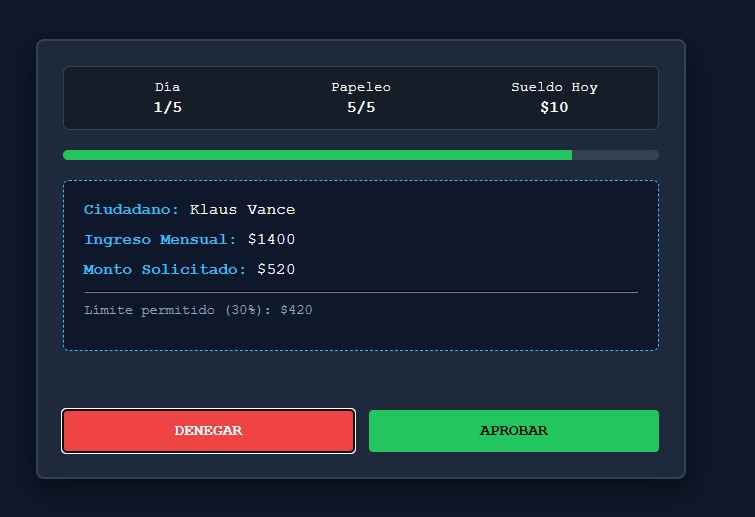
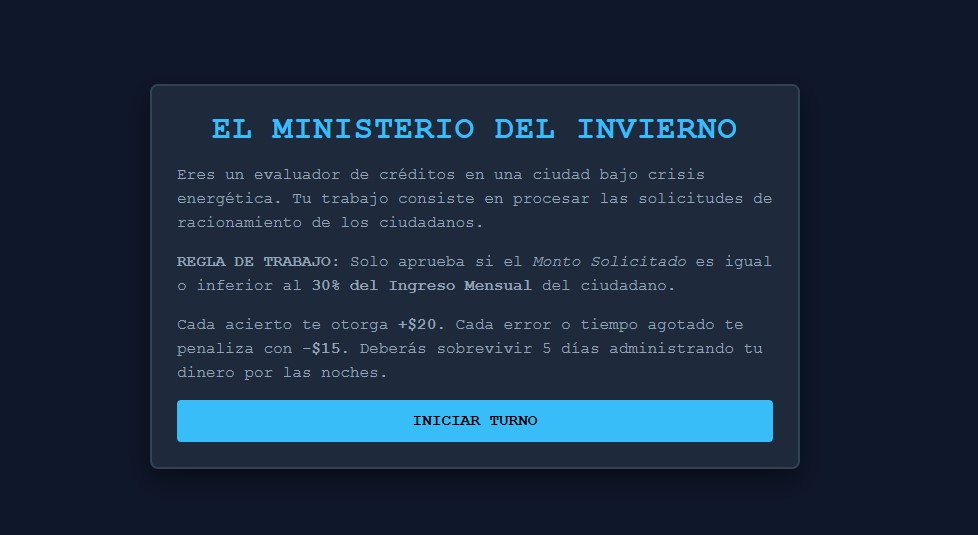
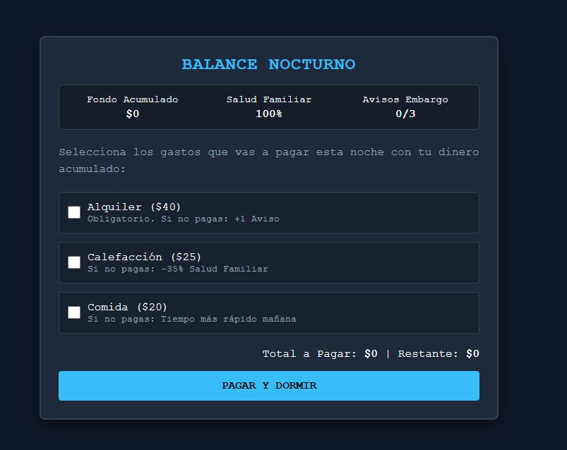
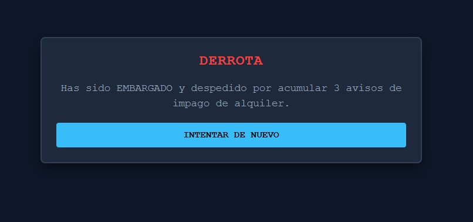

<div align="center">

# ❄️ El Ministerio del Invierno

### Sobrevive al sistema, administra tus ingresos y protege a tu familia



**Simulación de trabajo y gestión financiera en una ciudad distópica**


</div>

---

## 📖 Descripción

**El Ministerio del Invierno** es un videojuego educativo de simulación y gestión de recursos ambientado en una ciudad distópica afectada por una crisis energética. 

El jugador trabaja como analista de créditos y debe procesar solicitudes económicas bajo presión. Al finalizar cada jornada laboral, debe administrar el dinero ganado para cubrir los gastos esenciales de su familia. Cada decisión tiene consecuencias: un error durante el trabajo reduce los ingresos, mientras que una mala decisión financiera durante la noche puede afectar la salud familiar o provocar un embargo.

---

## 💡 Concepto y Premisa

El jugador representa a un analista de una institución burocrática en una ciudad fría y hostil. El propósito es sobrevivir durante **5 días**, mantener a la familia con salud y evitar acumular tres avisos de embargo.

*   **Público objetivo:** Jóvenes (18-25 años).
*   **Género:** Simulación de trabajo, gestión de recursos, puzle burocrático y estrategia financiera.
*   **Enseñanza:** Administración del dinero, priorización de necesidades, presupuesto limitado, costo de oportunidad y planificación.

---

## 🔄 Estructura de la Partida

El juego funciona en un ciclo continuo hasta alcanzar la victoria (día 5) o la derrota:

1.  **Fase de Día:** Procesamiento de 5 solicitudes de crédito.
2.  **Fase de Noche:** Administración del presupuesto familiar.

### 🏢 Fase de Día: Trabajo de Oficina

El jugador evalúa documentos con un tiempo límite de **10 segundos** (puede reducirse a 7,5s si hay penalizaciones). Debe decidir si `APROBAR` o `DENEGAR` basándose en la siguiente regla:

> **Regla de Evaluación (30%):**
> Monto solicitado ≤ (Ingreso mensual × 0.30)
> *Ejemplo: Si el ingreso es $1000, el límite es $300.*

**Economía Laboral:**

| Acción | Recompensa / Penalización |
| :--- | :--- |
| **Decisión Correcta** | + $20 |
| **Decisión Incorrecta** | - $15 |
| **Tiempo Agotado** | - $15 (y cuenta como incorrecta) |

### 🌙 Fase de Noche: Gestión del Presupuesto

Con el dinero acumulado en el día, el jugador debe decidir qué gastos cubrir.

| Gasto | Costo | Consecuencia si no se paga |
| :--- | :--- | :--- |
| **Alquiler** | $40 | +1 Aviso de embargo. |
| **Calefacción** | $25 | -35% de Salud familiar. |
| **Comida** | $20 | El temporizador del día siguiente baja a 7,5 segundos. |

---

## ⚖️ Condiciones de Fin de Partida

### ✅ Victoria
Completar los 5 días cumpliendo estas dos condiciones:
*   **Avisos de embargo:** Menos de 3.
*   **Salud familiar:** Mayor a 0%.

### ❌ Derrota
La partida termina inmediatamente si ocurre una de estas situaciones:
*   **Embargo:** Acumular 3 avisos por no pagar el alquiler.
*   **Pérdida de salud:** La salud familiar llega al 0% por no pagar la calefacción.

---

## 🕹️ Controles

Totalmente jugable con mouse o pantalla táctil.

*   **Día:** Clic en `APROBAR` o `DENEGAR`.
*   **Noche:** Clic en las casillas para seleccionar gastos y `PAGAR Y DORMIR` para confirmar.
*   **Fin de partida:** Clic en `INTENTAR DE NUEVO`.

---

## 🖼️ Capturas de Pantalla

| Pantalla Inicial | Fase de Trabajo (Día) |
| :---: | :---: |
|  |  |
| **Gestión Nocturna (Noche)** | **Pantalla Final** |
|  |  |

---

## 🛠️ Tecnologías y Desarrollo

Este proyecto fue desarrollado bajo un **Game Design Document (GDD)** para planificar mecánicas, reglas y progresiones.

*   **Tecnologías:** HTML5, CSS3, JavaScript puro (Vanilla JS), Manipulación del DOM.
*   **Despliegue:** Todo el juego está contenido en `index.html`. No requiere instalación, dependencias ni servidores; funciona directamente en cualquier navegador moderno.
*   **IA:** Se utilizó Inteligencia Artificial generativa como herramienta de apoyo para traducir las mecánicas del GDD a código.

### 📂 Estructura del Proyecto

```text
ministerio-del-invierno/
├── README.md
├── index.html
└── screenshots/
    ├── inicio.jpg
    ├── gameplay1.jpg
    ├── gameplay2.jpg
    └── fin.jpg
