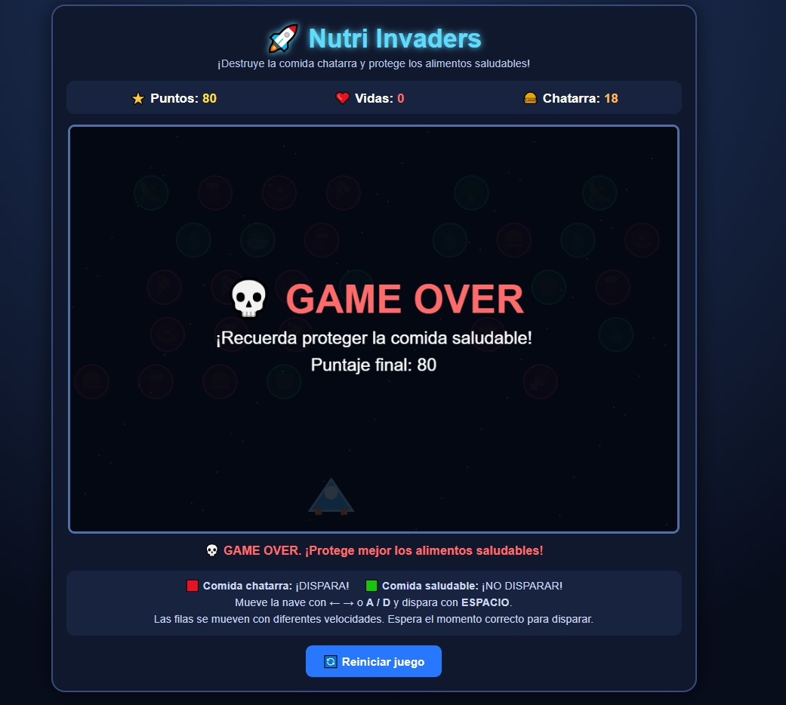

<div align="center">

# 🚀 Nutri Invaders

### Protege los alimentos saludables y elimina la comida chatarra


**Videojuego arcade educativo sobre alimentación saludable**

</div>

---

## 📖 Descripción

**Nutri Invaders** es un videojuego arcade educativo en el que el jugador controla una nave espacial y debe destruir la comida chatarra mientras protege los alimentos saludables.

Los alimentos se desplazan horizontalmente en diferentes filas. El jugador debe observarlos, identificar cuáles son poco saludables y disparar únicamente contra ellos.

El proyecto combina una mecánica clásica de disparos con contenidos educativos relacionados con nutrición y alimentación saludable.

---

## 💡 Idea del proyecto

La idea principal de Nutri Invaders es enseñar a niños en edad escolar a diferenciar entre alimentos saludables y comida chatarra mediante una experiencia interactiva.

En lugar de responder preguntas directamente, el jugador aprende tomando decisiones durante la partida:

- Disparar a la comida chatarra.
- Evitar disparar a los alimentos saludables.
- Observar los mensajes educativos.
- Corregir sus decisiones durante los siguientes intentos.

---

## 🎯 Objetivo del jugador

El objetivo es destruir toda la comida chatarra que aparece en la pantalla sin perder las tres vidas disponibles.

Para conseguirlo, el jugador debe:

1. Mover la nave horizontalmente.
2. Observar los alimentos en movimiento.
3. Identificar la comida chatarra.
4. Disparar con precisión.
5. Evitar destruir alimentos saludables.
6. Eliminar toda la comida chatarra.

---

## 🧩 Género

- Arcade educativo.
- Shooter 2D.
- Juego de clasificación.
- Inspirado en mecánicas clásicas de invasores espaciales.

---

## ⚙️ Mecánica principal

El jugador controla una nave espacial azul ubicada en la parte inferior de la pantalla.

En la parte superior aparecen diferentes alimentos organizados en filas. Cada fila se mueve horizontalmente con una velocidad y dirección determinadas.

El jugador debe disparar contra los alimentos poco saludables y evitar destruir los alimentos beneficiosos para la salud.

### Al destruir comida chatarra

- El jugador obtiene 10 puntos.
- El alimento desaparece.
- Disminuye el contador de comida chatarra restante.
- Aparece un mensaje de acierto.

### Al destruir un alimento saludable

- El jugador pierde una vida.
- El alimento desaparece.
- Aparece un mensaje de advertencia.
- La partida termina si las vidas llegan a cero.

---

## 🕹️ Controles

### Computadora

- `FLECHA IZQUIERDA`: mover la nave hacia la izquierda.
- `FLECHA DERECHA`: mover la nave hacia la derecha.
- `A`: mover la nave hacia la izquierda.
- `D`: mover la nave hacia la derecha.
- `ESPACIO`: disparar.

### Dispositivos móviles

El juego también contiene botones para:

- Mover la nave hacia la izquierda.
- Disparar.
- Mover la nave hacia la derecha.

---

## 🥗 Alimentos saludables

Los alimentos saludables deben ser protegidos.

El juego incluye:

- 🍎 Manzana.
- 🥦 Brócoli.
- 🥕 Zanahoria.
- 🍌 Banana.
- 🥗 Ensalada.
- 💧 Agua.

Disparar contra uno de estos alimentos provoca la pérdida de una vida.

---

## 🍔 Comida chatarra

La comida chatarra debe ser destruida para completar la partida.

El juego incluye:

- 🍔 Hamburguesa.
- 🍟 Papas fritas.
- 🍩 Dona.
- 🍕 Pizza.
- 🍫 Chocolate.
- 🍬 Dulces.
- 🥤 Gaseosa.

Cada alimento poco saludable destruido otorga 10 puntos.

---

## ⭐ Sistema de puntuación

El videojuego muestra permanentemente:

- Puntos acumulados.
- Vidas disponibles.
- Cantidad de comida chatarra restante.

El sistema funciona de la siguiente manera:

```text
Comida chatarra destruida: +10 puntos
Alimento saludable destruido: -1 vida
Vidas iniciales: 3
```

---

## ❤️ Sistema de vidas

El jugador comienza la partida con:

```text
3 vidas
```

Cada vez que destruye accidentalmente un alimento saludable pierde una vida.

Cuando el contador llega a cero, aparece la pantalla de derrota.

---

## ✅ Condición de victoria

El jugador gana cuando elimina toda la comida chatarra que permanece en la pantalla.

Al conseguirlo, el juego muestra:

```text
🏆 ¡GANASTE!
¡Destruiste toda la comida chatarra!
```

También se presenta la puntuación final obtenida.

---

## ❌ Condición de derrota

El jugador pierde cuando destruye tres alimentos saludables y se queda sin vidas.

El juego muestra:

```text
💀 GAME OVER
¡Recuerda proteger la comida saludable!
```

También se presenta la puntuación final alcanzada.

---

## 🎓 Componente educativo

Nutri Invaders enseña a reconocer alimentos saludables y poco saludables mediante las consecuencias de las acciones del jugador.

El jugador recibe retroalimentación inmediata:

- Los aciertos aumentan la puntuación.
- Los errores reducen las vidas.
- Los mensajes recuerdan qué alimentos deben protegerse.
- El contador indica cuánta comida chatarra queda por eliminar.

La mecánica fomenta:

- Atención visual.
- Clasificación de alimentos.
- Toma rápida de decisiones.
- Coordinación.
- Aprendizaje mediante prueba y error.

---

## ↔️ Movimiento de los alimentos

Los alimentos están distribuidos en cinco filas.

Cada fila:

- Se mueve horizontalmente.
- Tiene una velocidad diferente.
- Puede desplazarse en una dirección distinta.
- Tiene un desfase para evitar que todos los alimentos estén alineados.

Esta dinámica obliga al jugador a observar y esperar el momento adecuado antes de disparar.

---

## 🖼️ Capturas de pantalla

### Pantalla inicial/Gameplay

La vista inicial muestra el título, los indicadores, la nave, los alimentos, las instrucciones y el botón para reiniciar la partida.

Durante la partida pueden observarse los alimentos en movimiento, los proyectiles, la nave, la puntuación, las vidas y la comida chatarra restante.


### Pantalla final

Al terminar aparece una pantalla de victoria o derrota junto con la puntuación final obtenida.



---

## 🛠️ Tecnologías utilizadas

- HTML5.
- CSS3.
- JavaScript.
- Canvas 2D.
- Animaciones mediante JavaScript.
- Diseño web adaptable.
- GitHub para organización, documentación y publicación.

El videojuego está contenido en un único archivo llamado `index.html` y no utiliza dependencias externas.

---

## ▶️ Cómo ejecutar el juego

### Ejecución local

1. Descarga el archivo `index.html`.
2. Ábrelo con Chrome, Edge o Firefox.
3. Mueve la nave con las flechas o las teclas `A` y `D`.
4. Dispara con la barra espaciadora.
5. Destruye únicamente la comida chatarra.
6. Protege los alimentos saludables.
7. Elimina toda la comida chatarra para ganar.

### Versión en línea

La versión jugable se habilitará cuando el portafolio sea publicado mediante GitHub Pages.

<div align="center">

https://img.shields.io/badge/Jugar-Próximamente-808080?style=for-the-badge

</div>

---

## 🤖 Uso de inteligencia artificial

La inteligencia artificial generativa fue utilizada como herramienta de apoyo para crear el prototipo mediante un prompt detallado.

El prompt definió:

- El objetivo educativo.
- El género arcade.
- La mecánica de movimiento y disparo.
- Los alimentos saludables.
- Los alimentos poco saludables.
- El sistema de puntuación.
- El sistema de vidas.
- Las condiciones de victoria y derrota.
- Los elementos visuales.
- Los mensajes educativos.
- Los requisitos técnicos.

El resultado generado fue revisado y probado para comprobar su funcionamiento en el navegador.

### Aporte personal

Mi participación en el proyecto incluyó:

- La revisión de los requisitos.
- La evaluación de la temática educativa.
- La comprobación de los controles.
- Las pruebas del sistema de disparos.
- La verificación del sistema de vidas y puntuación.
- Las pruebas de las condiciones de victoria y derrota.
- La organización de los archivos en GitHub.
- La documentación del proyecto.
- La identificación de posibles mejoras.

---

## 📚 Aprendizajes

Durante el desarrollo de este proyecto aprendí a:

- Combinar una mecánica arcade con un objetivo educativo.
- Clasificar alimentos saludables y poco saludables.
- Definir controles de movimiento y disparo.
- Trabajar con un sistema de vidas.
- Implementar condiciones de victoria y derrota.
- Utilizar colisiones entre proyectiles y objetivos.
- Crear elementos gráficos con Canvas 2D.
- Probar un videojuego directamente en el navegador.
- Organizar y documentar un proyecto en GitHub.

---

## 🔧 Mejoras futuras

En una siguiente versión me gustaría:

- Agregar una pantalla de inicio independiente.
- Añadir una pantalla de instrucciones antes de comenzar.
- Incorporar efectos de sonido y música.
- Mostrar información nutricional específica para cada alimento.
- Evitar que los colores revelen inmediatamente la categoría del alimento.
- Agregar niveles de dificultad.
- Aumentar la variedad de alimentos.
- Incorporar enemigos o eventos especiales.
- Agregar una pausa.
- Guardar las mejores puntuaciones.
- Mejorar los controles táctiles.
- Realizar pruebas con estudiantes.

---

## 📂 Estructura del proyecto

```text
nutri-invaders/
├── README.md
├── index.html
└── screenshots/
    ├── inicio.jpg
    ├── gameplay.jpg
    └── fin.jpg
```

- `README.md`: documentación del videojuego.
- `index.html`: archivo completo y ejecutable.
- `screenshots/inicio.jpg`: vista inicial.
- `screenshots/gameplay.jpg`: momento de juego.
- `screenshots/fin.jpg`: pantalla de victoria o derrota.

---

## 👤 Autor

**Americo Oswaldo Ramirez Rocha**

Proyecto desarrollado para la asignatura **Game Development**.

---

<div align="center">

https://img.shields.io/badge/Volver-Proyectos-7B2CBF?style=for-the-badge](../)

https://img.shields.io/badge/Volver-Portafolio-0078D4?style=for-the-badge](../../)

</div>
